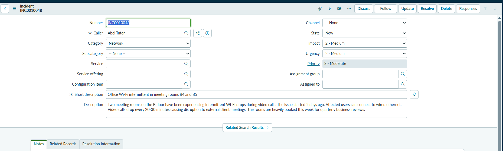
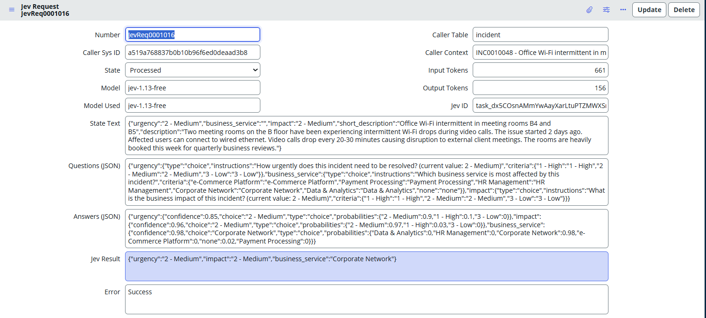
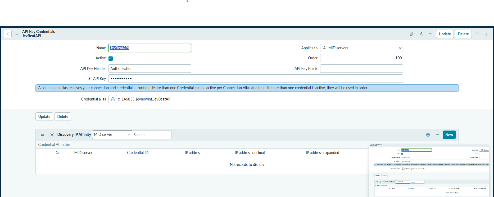
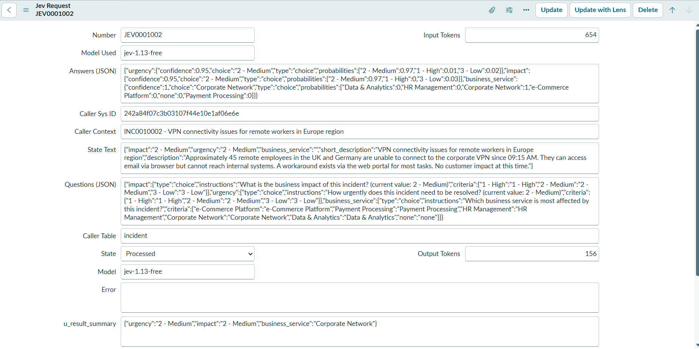
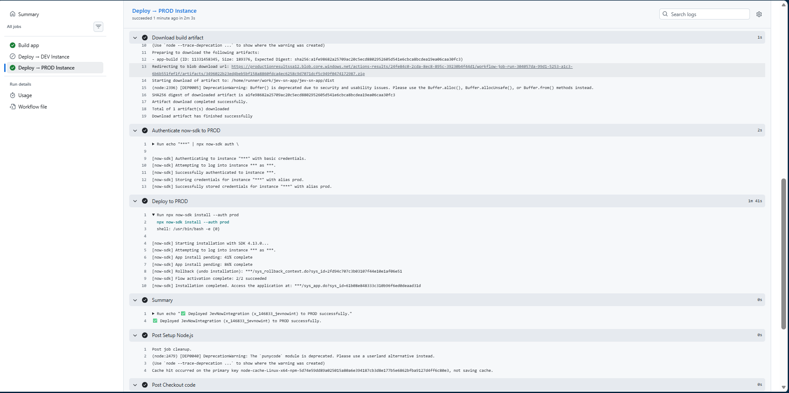
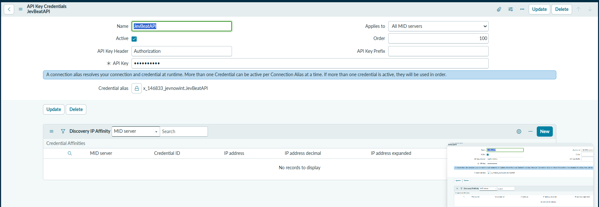

# JevNowIntegration — Setup & Replication Guide

**GitHub repo:** https://github.com/anilvaranasi/jev-sn-app
**Scoped app:** `x_146833_jevnowint` | `JevNowIntegration`
**SDK:** `@servicenow/sdk` 4.13.0
**Jev API:** https://api.beatapi.io/v1/systemone | Model: `jev-1.13-free`
**BeatAPI console:** https://console.typesafe.ai
**Jev documentation:** https://docs.typesafe.ai

---

## Proof of Concept — End-to-end test result

### Source incident — INC0010048



The incident has **Impact: 2 - Medium**, **Urgency: 2 - Medium**, **Priority: 3 - Moderate**
with no business service assigned. The BR on `x_146833_jevnowint_request` reads this record,
builds the questions from the field map config, and the flow submits them to Jev.

### Processed Jev Request — JevReq0001016



| Field | Value | Notes |
|---|---|---|
| **State** | Processed | Full cycle completed successfully |
| **Model** | `jev-1.13-free` | Free tier model |
| **Input / Output Tokens** | 661 / 156 | Efficient — structured state + 3 questions |
| **Jev ID** | `task_dx5COsnAMmYwAay...` | Unique task ID from BeatAPI |
| **Jev Result** | `{"urgency":"2 - Medium","impact":"2 - Medium","business_service":"Corporate Network"}` | Clean flat summary |
| **Error** | Success | |

**Answers (JSON) breakdown:**

| Question | Answer | Confidence | Probabilities |
|---|---|---|---|
| `urgency` | `2 - Medium` | 0.85 | 2-Medium: 0.90, 1-High: 0.10, 3-Low: 0.0 |
| `impact` | `2 - Medium` | 0.96 | 2-Medium: 0.97, 1-High: 0.03, 3-Low: 0.0 |
| `business_service` | `Corporate Network` | 0.98 | Corporate Network: 0.98, others: ~0.0 |

Jev correctly identified **Corporate Network** as the affected service (98% confidence)
and assessed both impact and urgency as **Medium** — consistent with a Wi-Fi issue that
has a workaround (wired ethernet) but disrupts external client meetings.

> **Note on `business_service`:** the incident had no service assigned in SN, yet Jev
> inferred **Corporate Network** from the description alone — "Wi-Fi drops", "VPN", "wired ethernet".
> This demonstrates Jev reasoning over unstructured text, not just structured field values.

### PROD verification — Flow execution

After promoting to PROD, the same end-to-end cycle was confirmed working in the production instance.



The flow ran successfully in PROD — all steps completed, REST call to BeatAPI returned `200 OK`,
and the Jev answers were written back to the request record.

### PROD verification — Jev Request result



The PROD Jev Request record shows state **Processed**, `u_result_summary` populated with the
structured answer map, and no errors — confirming the connection alias, credential, and flow
all function correctly in the production instance.

---

## What this app does

JevNowIntegration embeds the TypeSafe Jev AI decisions engine into ServiceNow workflows.
Given any source record (e.g. an incident), it submits structured AI judgment questions
and writes typed answers back — enabling automated triage, prioritisation, and routing
without hardcoded rules.

**End-to-end flow:**

```
Source record created (e.g. incident)
        │
        │  Any BR / script creates a Jev Request record
        │  setting u_caller_table, u_caller_sys_id, u_state=pending
        ▼
x_146833_jevnowint_request  (before insert)
        │
        │  BR: "Populate Jev Questions on Insert"
        │  → queries x_146833_jevnowint_field_map for active rows
        │  → reads field values from caller record
        │  → writes u_questions (JSON) + u_state_text (structured JSON)
        ▼
Flow: TriggerJevIntegration  (triggers on u_state=pending)
        │
        │  Reads u_questions + u_state_text (already built by BR)
        │  → calls InvokeJevRESTAPI action → BeatAPI
        │  → writes back u_answers, u_model_used, u_tokens, u_state=processed
        ▼
x_146833_jevnowint_request  (after update, u_state=processed)
        │
        │  BR: "Populate Result Summary on Processed"
        │  → reads u_answers
        │  → writes u_result_summary: { field → top answer value }
        ▼
Downstream BR / Flow reads u_result_summary to act on answers
(e.g. set incident priority, route to team, escalate)
```

---

## Architecture

```
Developer (Bob / local)
        │
        │  git push
        ▼
    mydev  ◄──────────────────────────────────────────────────────┐
        │                                                          │
        │  merge                                  pull-from-sn.yml │
        ▼                                       (workflow_dispatch) │
    nowdev  ──── deploy.yml (push trigger) ──► ServiceNow DEV ─────┘
        │
        │  merge
        ▼
      prod  ──── deploy.yml (push trigger) ──► ServiceNow PROD
```

**Branch rules:**
- `mydev` — working branch. All code changes and SN pulls land here
- `nowdev` — deploy gate for DEV. Only receives merges from `mydev`
- `prod` — deploy gate for PROD. Only receives merges from `nowdev`

---

## What's in the repo

### Fluent source (deployed to SN via SDK)

| Path | What it is |
|---|---|
| `src/fluent/generated/data/table/sys_db_object_1c4ef6e4...now.ts` | `x_146833_jevnowint_request` table — 16 columns |
| `src/fluent/generated/data/table/sys_db_object_jev_field_map.now.ts` | `x_146833_jevnowint_field_map` config/lookup table |
| `src/fluent/generated/automation/flow/sys_hub_flow_4f617a98...now.ts` | `TriggerJevIntegration` flow |
| `src/fluent/generated/automation/flow/sys_hub_action_type_definition_4c1712d8...now.ts` | `InvokeJevRESTAPI` custom action |
| `src/fluent/generated/server-development/script-include/sys_script_include_35348259...` | `JevClient` script include |
| `src/fluent/generated/server-development/script-include/sys_script_include_c50b2213...` | `JevQuestions` script include |
| `src/fluent/generated/server-development/script-include/sys_script_include_db003cec...` | `JevFieldMap` script include |
| `src/fluent/generated/server-development/business-rule/` | Business rules (pulled from SN) |
| `src/fluent/generated/keys.ts` | SDK sys_id key map |

### Reference scripts (not deployed — paste into SN manually)

| Path | What it is |
|---|---|
| `src/server/br_populate_questions_on_insert.js` | BR: auto-populate u_questions + u_state_text on Jev Request insert |
| `src/server/br_populate_result_summary.js` | BR: populate u_result_summary when state → processed |
| `src/server/seed_jev_field_map.fix.js` | Fix script: seed incident field map rows (impact, urgency, business_service) |
| `src/server/seed_jev_requests_sample.fix.js` | Fix script: create sample Jev Request records from 5 recent open incidents |

### Workflow files

| Path | What it is |
|---|---|
| `.github/workflows/deploy.yml` | Auto-deploys on push to `nowdev` or `prod` |
| `.github/workflows/pull-from-sn.yml` | Manual — pulls SN DEV → `mydev` |

---

## Tables

### `x_146833_jevnowint_request` — Jev Request

| Column | Type | Purpose |
|---|---|---|
| `u_state` | Choice | `pending` → `processing` → `processed` / `failed` |
| `u_state_text` | String(4000) | Structured JSON of caller record fields — sent as `state` to Jev |
| `u_questions` | String(4000) | JSON questions map built by BR from field map config |
| `u_model` | String(40) | Jev model to use (default: `jev-1.13-free`) |
| `u_answers` | String(4000) | Full raw Jev response answers JSON |
| `u_result_summary` | String(4000) | Clean flat map: `{ field → top answer value }` |
| `u_model_used` | String(40) | Actual model used as returned by Jev |
| `u_input_tokens` | Integer | Input token count |
| `u_output_tokens` | Integer | Output token count |
| `u_error` | String(1000) | Error message if state=failed |
| `u_caller_table` | String(80) | Source table name, e.g. `incident` |
| `u_caller_sys_id` | String(32) | sys_id of the source record |
| `u_caller_context` | String(200) | Human-readable label, e.g. `INC0010042 - VPN issue` |
| `u_jev_id` | String(50) | Jev task ID returned by the API |
| `u_result` | String(4000) | Generic result placeholder |

### `x_146833_jevnowint_field_map` — Jev Field Map

Config/lookup table — one row per field to evaluate per source table.

| Column | Type | Purpose |
|---|---|---|
| `u_source_table` | String(80) | SN table name, e.g. `incident` |
| `u_source_field` | String(80) | Field name on that table, e.g. `severity` |
| `u_jev_type` | Choice | `noul` / `choice` / `score` |
| `u_choices` | String(4000) | JSON array of option keys, e.g. `["1 - High","2 - Medium","3 - Low"]` |
| `u_question` | String(500) | Natural-language question text sent to Jev |
| `u_active` | Boolean | Toggle row on/off without deleting |

**Seeded rows for `incident`:**

| Field | Jev Type | Choices |
|---|---|---|
| `impact` | choice | `["1 - High","2 - Medium","3 - Low"]` |
| `urgency` | choice | `["1 - High","2 - Medium","3 - Low"]` |
| `business_service` | noul | *(none — reference field)* |

---

## Script includes

### `JevClient`
Fluent HTTP wrapper for the BeatAPI Jev endpoint. Chain `.withState().ask().evaluate()`.

### `JevQuestions`
Builder helpers for raw Jev primitives:
- `JevQuestions.noul(instructions, criteria)` — yes/no probability
- `JevQuestions.choice(instructions, criteria)` — pick one option
- `JevQuestions.score(instructions, criteria)` — rated level 0–N

### `JevFieldMap`
Dynamic question builder driven by `x_146833_jevnowint_field_map`:
```javascript
var questions = JevFieldMap.forRecord('incident', current.sys_id + '');
// Returns ready-to-submit questions object keyed by field name
```

---

## Business Rules

### BR 1 — Populate Jev Questions on Insert
- **Table:** `x_146833_jevnowint_request`
- **When:** before insert
- **Condition:** `u_caller_table != '' && u_caller_sys_id != '' && u_questions == ''`
- **What:** calls `JevFieldMap.forRecord()` → writes `u_questions` + `u_state_text`
- **Script:** `src/server/br_populate_questions_on_insert.js`

### BR 2 — Populate Result Summary on Processed
- **Table:** `x_146833_jevnowint_request`
- **When:** after update
- **Condition:** `current.u_state == 'processed' && current.u_state.changesTo('processed')`
- **What:** reads `u_answers` → writes `u_result_summary` flat map
- **Script:** `src/server/br_populate_result_summary.js`

> Both BRs are created manually in SN then pulled into repo via the Pull workflow.

---

## GitHub Actions secrets required

Configure under **repo → Settings → Secrets and variables → Actions**:

| Secret | Value |
|---|---|
| `SN_DEV_INSTANCE` | e.g. `https://dev123456.service-now.com` |
| `SN_DEV_USER` | ServiceNow DEV admin username |
| `SN_DEV_PASS` | ServiceNow DEV admin password |
| `SN_PROD_INSTANCE` | e.g. `https://prod123456.service-now.com` |
| `SN_PROD_USER` | ServiceNow PROD admin username |
| `SN_PROD_PASS` | ServiceNow PROD admin password |

Secrets are scoped to GitHub environments — `dev` and `production`.
Create environments under **repo → Settings → Environments** before adding secrets.

> ⚠️ Environment names are **case-sensitive** and must match the `environment:` key in
> `deploy.yml` exactly — `dev` and `production` (all lowercase). A mismatch means secrets
> resolve to empty strings and the `now-sdk auth` command fails with
> `Missing required argument for --add`.

---

## BeatAPI Connection & Credential Alias

The Jev API key and endpoint are **never stored in the repo**. They are configured in
ServiceNow using a **Connection & Credential Alias** — the native SN way to manage
external service credentials securely.

### Alias details

| Field | Value |
|---|---|
| **Alias name** | `JevBeatAPIConnection` |
| **Alias ID** | `x_146833_jevnowint.JevBeatAPIConnection` |
| **Connection URL** | `https://api.beatapi.io/v1/systemone` |
| **Credential name** | `JevBeatAPI` |
| **Credential type** | `api_key` (Authorization header) |

### SN export files (reference)

Three SN XML exports are stored in `docs/sn-exports/` for reference and manual import:

| File | What it is |
|---|---|
| `sys_alias_ec27b76c83fb0b10b96f6ed0deaad3f5.xml` | Connection alias record (`JevBeatAPIConnection`) |
| `http_connection_c71773ec83fb0b10b96f6ed0deaad329.xml` | HTTP connection record (`JevBeatAPIUrl`) with the endpoint URL |
| `api_key_credentials_5e2b629883fb4710b96f6ed0deaad32f.xml` | API key credential record (`JevBeatAPI`) — **api_key field is masked** |

> ⚠️ The `api_key` field in the credentials XML is set to `MASKED_SET_MANUALLY`.
> You must update it with your real Bearer token after importing (see steps below).

### How to set it up on a new instance — Option A: XML import

Use this approach when the app deploy did not create the alias, or when setting up a fresh instance manually.

1. Navigate to **System Import Sets → Load Data** (or use **System Update Sets → Import XML**)
2. Import in this order:
   1. `docs/sn-exports/sys_alias_ec27b76c83fb0b10b96f6ed0deaad3f5.xml` — creates the alias record
   2. `docs/sn-exports/api_key_credentials_5e2b629883fb4710b96f6ed0deaad32f.xml` — creates the credential record (key is masked)
   3. `docs/sn-exports/http_connection_c71773ec83fb0b10b96f6ed0deaad329.xml` — creates the connection record linking alias + credential + URL
3. After import, update the API key (see **Update the API key** below)



### How to set it up on a new instance — Option B: Manual creation

1. Navigate to **Connections & Credentials → Connection & Credential Aliases**
2. Find `JevBeatAPIConnection` (deployed by the app) or create it:
   - **Name:** `JevBeatAPIConnection`
   - **Type:** `Connection`
3. Open the alias → **Credentials** tab → **New**:
   - **Type:** `API Key`
   - **Name:** `JevBeatAPI`
   - **API key header name:** `Authorization`
   - **API key:** `Bearer sk-xxxxxxxxxxxxxxxxxxxxxxxx`
4. Open the alias → **Connections** tab → **New**:
   - **Name:** `JevBeatAPIUrl`
   - **Connection URL:** `https://api.beatapi.io/v1/systemone`
   - **Credential:** select `JevBeatAPI` from above
5. Save — the `InvokeJevRESTAPI` action uses this alias automatically

### Update the API key

After XML import (Option A), the credential record has a masked placeholder. Update it:

1. Navigate to **Connections & Credentials → Credentials**
2. Open **JevBeatAPI**
3. In the **API key** field enter: `Bearer sk-xxxxxxxxxxxxxxxxxxxxxxxx`
   (replace with your real key from [https://console.typesafe.ai](https://console.typesafe.ai))
4. Save



> ⚠️ The real Bearer token is **never committed to the repo**.
> Set it directly in each SN instance (DEV and PROD separately).

---

## GitHub Actions permissions

Under **repo → Settings → Actions → General → Workflow permissions**:  
Select **Read and write permissions** — required for the pull workflow to commit to `mydev`.

---

## Day-to-day workflow

### Making changes in SN DEV and pulling to repo

1. Make changes in SN DEV (tables, flows, script includes, BRs, etc.)
2. **GitHub → Actions → Pull from ServiceNow → Run workflow** (branch: `mydev`)
3. Pull locally: `git pull --rebase origin mydev`
4. Clean up any stale artefacts (sys_properties, test_column docs — see gotchas)
5. Commit and push any manual cleanups

### Deploying to DEV

```bash
git checkout nowdev
git merge mydev --no-ff -m "merge: <description>"
git push origin nowdev
git checkout mydev
```

### Deploying to PROD

```bash
git checkout prod
git merge nowdev --no-ff -m "merge: <description>"
git push origin prod
git checkout mydev
```

### After deploying to a new PROD instance — post-deploy steps

The `JevBeatAPIConnection` alias shell is deployed automatically by the app.
The credential and connection URL must be set manually. Two options:

**Option A — XML import (fastest):**
1. Go to **System Update Sets → Import XML** (or **System Import Sets → Load Data**)
2. Import in order:
   1. `docs/sn-exports/sys_alias_ec27b76c83fb0b10b96f6ed0deaad3f5.xml`
   2. `docs/sn-exports/api_key_credentials_5e2b629883fb4710b96f6ed0deaad32f.xml`
   3. `docs/sn-exports/http_connection_c71773ec83fb0b10b96f6ed0deaad329.xml`
3. Open **Connections & Credentials → Credentials → JevBeatAPI**
4. Set **API key** to `Bearer sk-xxxxxxxxxxxxxxxxxxxxxxxx` (your key from https://console.typesafe.ai)
5. Save

**Option B — Manual:**
See **BeatAPI Connection & Credential Alias → Option B: Manual creation** section above.

> The Bearer token is **never in the repo** — set it directly in each instance.

---

## Code Promotion — mydev → nowdev → prod

This is the full promotion sequence used to take changes from development through to production.

### Prerequisites
- GitHub environments `dev` and `production` exist under **repo → Settings → Environments**
- All 6 secrets are set in the correct environments (see GitHub Actions secrets section)
- `mydev` is clean and all SN changes have been pulled

### Step 1 — Pull latest from SN DEV into mydev

```bash
# Trigger via GitHub Actions (preferred)
# GitHub → Actions → Pull from ServiceNow → Run workflow → branch: mydev

# Then sync locally
git pull --rebase origin mydev
```

### Step 2 — Deploy to SN DEV (mydev → nowdev)

```bash
git checkout nowdev
git merge mydev --no-ff -m "merge: <description of changes>"
git push origin nowdev
git checkout mydev
```

GitHub Actions `deploy.yml` triggers automatically → **Build → Deploy → DEV Instance**.

### Step 3 — Verify in SN DEV

- Confirm tables, flows, script includes, BRs are as expected
- Run any fix scripts needed (seed data, label fixes, etc.)
- Test end-to-end by creating a `x_146833_jevnowint_request` record

### Step 4 — Deploy to SN PROD (nowdev → prod)

```bash
git checkout prod
git merge nowdev --no-ff -m "merge: promote to prod — <description>"
git push origin prod
git checkout mydev
```

GitHub Actions `deploy.yml` triggers automatically → **Build → Deploy → PROD Instance**.

### Step 5 — Post-deploy PROD setup (first time only)

If this is the first deploy to a PROD instance, set up the connection alias manually (see section above).


Once the deploy job completes, verify end-to-end in PROD:


### Troubleshooting

| Symptom | Cause | Fix |
|---|---|---|
| `Missing required argument for --add` | `SN_PROD_INSTANCE` secret is empty | Check secrets are in the `production` environment (not `Prod` or `PROD`) |
| `Deploy → PROD Instance` skipped | Workflow triggered by `nowdev` not `prod` | Push to `prod` branch, not `nowdev` |
| Job shows "Waiting for review" | `production` environment has protection rules | Approve the deployment in GitHub → Actions → the run |
| Re-run needed after fixing secrets | Secrets were missing when job ran | GitHub → Actions → failed run → Re-run failed jobs |

---

## Adding a new source table to Jev

1. Run `seed_jev_field_map.fix.js` pattern — insert rows into `x_146833_jevnowint_field_map` for the new table
2. When creating a `x_146833_jevnowint_request` record set `u_caller_table=<table>`, `u_caller_sys_id=<sys_id>`, `u_state=pending`
3. The BR auto-builds questions, the flow calls Jev, BR 2 writes the summary — no flow changes needed

---

## Replicating on a new laptop

```bash
git clone https://github.com/anilvaranasi/jev-sn-app.git
cd jev-sn-app
git checkout mydev
npm install
npm run build   # verify build passes
```

---

## Future Use Cases

The `x_146833_jevnowint_field_map` config-driven architecture means extending Jev to any
ServiceNow table requires only adding rows — no code changes. Below are planned use cases.

### Change Management — Change Risk Assessment

**Table:** `change_request`

Jev evaluates each change request before approval to produce a structured risk profile.

| Field | Jev Type | Question |
|---|---|---|
| `short_description` | noul | Does this change carry a high risk of service disruption? |
| `type` | choice | What category of risk does this change represent? |
| `risk` | score | How would you rate the overall risk level of this change? |
| `u_affected_services` | noul | Are any critical production services affected by this change? |

**Output used to:**
- Auto-set `risk` and `risk_impact_analysis` fields on the change record
- Flag changes above a risk threshold for CAB review
- Suggest assignment group based on risk category

---

### IRM — Control Objectives & Entity Applicability

**Table:** `sn_compliance_policy_statement` (or custom IRM table)

Jev assesses whether a given control objective applies to a specific entity (system, vendor, process).

| Field | Jev Type | Question |
|---|---|---|
| `short_description` | noul | Is this control objective applicable to the entity described in the state? |
| `category` | choice | Which compliance domain does this control objective primarily belong to? |
| `applicability` | score | How strongly does this control apply to the entity? |

**Output used to:**
- Auto-populate applicability assessments across large control libraries
- Surface high-applicability controls for mandatory evidence collection
- Flag ambiguous controls for human review based on low confidence scores

---

### SecOps — Vulnerability Threat Level & False Positive Validation

**Table:** `sn_si_vulnerability` (or `sn_vul_vulnerable_item`)

Jev assesses the real-world threat level of a vulnerability given the asset context, and
validates whether an alert is a genuine threat or a false positive.

| Field | Jev Type | Question |
|---|---|---|
| `short_description` | score | How severe is the actual threat posed by this vulnerability in context? |
| `severity` | choice | What priority level should this vulnerability be assigned for remediation? |
| `false_positive` | noul | Is this vulnerability alert likely a false positive given the asset and environment context? |
| `exploitability` | noul | Is there evidence this vulnerability is actively exploitable in the current environment? |

**Output used to:**
- Re-prioritise vulnerability queues based on contextual threat level, not just CVSS score
- Auto-close likely false positives (confidence > 0.90) for human confirmation
- Escalate actively exploitable vulnerabilities to P1 immediately

---

## Known gotchas

| Issue | Fix |
|---|---|
| `sys_properties_336a80e8...` and `sys_properties_432c8f92...` come back on every pull | Delete them after each pull — they are SN-internal properties not scoped to the app |
| `test_column` doc comes back on pull | Delete `sys_documentation_x_146833_jevnowint_request_test_column_en.now.ts` — delete the column from SN permanently |
| New BR / script include has no `$id` | Create in SN first, pull to get the real sys_id, then it's tracked forever |
| `now-sdk transform` produces duplicate `sys_documentation` files | Delete standalone files in `src/fluent/generated/other/sys-documentation/` |
| `IntegerColumn` with `maxLength` causes build warnings | Remove `maxLength` from `IntegerColumn` |
| Pull workflow fails with 403 on push | Enable **Read and write permissions** under repo → Settings → Actions → General |
